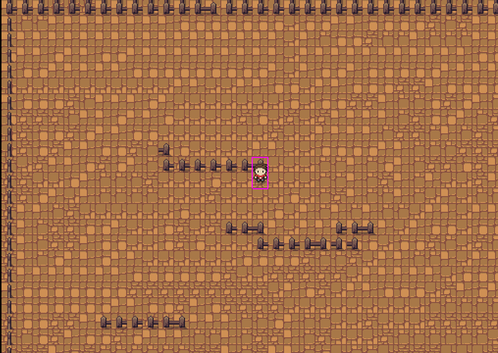

# 2D Verse App 
### (Basically an app where you join and hangout with friends)

This project is an RPG-like game built using Phaser.js and GridEngine. The game allows a player to move around in a tilemap world and interact with objects and environments.

server: https://github.com/Xanthium7/phaser_game_server

## DAY 1:
- Achieved Player movement
- Achieved Player Collision with fences

## DAY 2 - 5:
- Achieved Player movement with Walking animation
- Achieved Player movement to be synced between Multiple windows
- Multiplayer Functionality in the begining stages

https://github.com/user-attachments/assets/f1f731d4-3beb-4a94-824a-c9748e46e092

## DAY 6:
- Added Player Name field which moves around with player
- Player name does not exist yet, so i used first 6 letters of Player id

## DAY 7:
- Made it so that very new player will get a specific sprite (built a hash function that generates an index between 0 and 9 based on player id)
- this will be useful in distinguishing multiple players
- imporvements needed: every new player can select their needed color

## DAY 8
- Added ability to create and join multiple rooms
- the players can join unquie individual rooms
- This was easier than what iI expected initally,  since SOCKETS.IO had room feature available already
refrence link: https://socket.io/docs/v3/rooms/

## DAY 9 - 10
- Added Clerk Authentication
- Made so the username will be shown as IGNs
- This took a while cause react strict mode was causing double renderings and breaking the game, had to disable it

## DAY 11 - 13
- Addd a working room chat in all game instances.
- Fixed the issues with room chat contarols and game ckey conterols overlapping

## DAY 14
- I was wokring on a new map for this game for a while now and Finally added it to the Game
- Added a Feature to Sprint when u hold down shift key, makes you go twice the speed
- Fixed the Name text bug where it got overloapped by fneces, added a Depth value of 10

https://github.com/user-attachments/assets/d6f0b0de-1008-4716-b40f-00a54a43c284

## DAY 15, 16, 17
- spend time exclusively on learning more about WEB RTC and its functioning.
- You can refrence my lecturen notes here:- (incase your also trying to learn):
- APPFLOWY DOCUMENT NOTES:
https://appflowy.com/2148cd58-453e-4f2e-af08-21d317bc30be/Untitled-ffccec75-fa91-454f-b4c4-4940179477ab

## DAY 18, 19, 20
- kept messing around with web rtc on a test 'video' branch
- got promising working results on 'video2' branch and merged it with main
- SO GOT VIDEO CALL THINGY WORKINGGG
- A player goes to some another player and and press 'F4' key it sends a Video call request
  
  

  
- Spend a long while debugging cause NAT and fireWALL protection required the need for TURN servers and I was just using google and twilio STUn servers,
- TURN SERVER THAT I USED: https://www.metered.ca/stun-turn (Yes the 500Mb free plan)
- Ill also add the WEB RTC flow in my project, (incase its confusing)
  

  

